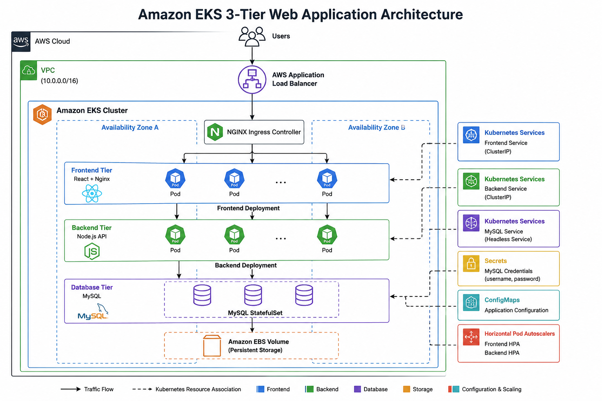

# ☸️ Amazon EKS 3-Tier Web Application Deployment


---

## 📖 Project Overview

This project demonstrates the deployment of a **containerized three-tier web application** on **Amazon Elastic Kubernetes Service (EKS)** using production-oriented Kubernetes resources and DevOps practices.

The application itself was used as a **sample deployment target** for learning and implementing Kubernetes deployment strategies. My primary contribution focused on designing, deploying, configuring, and troubleshooting the Kubernetes infrastructure rather than developing the application source code.

The deployment includes best practices such as **Deployments**, **Services**, **Secrets**, **Persistent Volumes**, **Persistent Volume Claims**, **StatefulSets**, **Ingress**, and **Horizontal Pod Autoscalers** to build a scalable and production-ready Kubernetes environment.

---

# 🏗️ Architecture

<p align="center">

> **Architecture Diagram (Coming Soon)**

<!-- Replace with the actual architecture diagram -->



</p>

---

## 🔄 Architecture Flow

```text
                    🌍 User
                       │
                       ▼
            AWS Application Load Balancer
                       │
                       ▼
          NGINX Ingress Controller
                       │
                       ▼
        Frontend Deployment (React + Nginx)
                       │
                       ▼
        Backend Deployment (Node.js API)
                       │
                       ▼
          MySQL StatefulSet Database
                       │
                       ▼
        Persistent Volume & Persistent Storage
```

---

## ☁️ AWS Components

| Component | Purpose |
|-----------|---------|
| Amazon EKS | Managed Kubernetes Cluster |
| EC2 Worker Nodes | Run Kubernetes Pods |
| Application Load Balancer | Exposes the application externally |
| Kubernetes Ingress | Routes external HTTP traffic |
| Deployments | Manage frontend & backend pods |
| StatefulSet | Provides stable MySQL deployment |
| Persistent Volume | Stores database data |
| Persistent Volume Claim | Requests persistent storage |
| ConfigMaps | Application configuration |
| Secrets | Secure database credentials |
| Services | Internal communication between components |
| Horizontal Pod Autoscaler | Automatically scales application pods |

---

# 🚀 DevOps Implementation Highlights

- ☸️ Deployed a **three-tier web application** on **Amazon Elastic Kubernetes Service (EKS)**.

- 🐳 Used **Docker** containers for the frontend, backend, and database workloads.

- 🌐 Exposed the application externally using **AWS Load Balancer** and **NGINX Ingress Controller**.

- ⚙️ Managed frontend and backend applications using **Kubernetes Deployments**.

- 🗄️ Deployed MySQL using a **StatefulSet** with persistent storage.

- 💾 Implemented **Persistent Volumes (PV)** and **Persistent Volume Claims (PVC)** to retain database data.

- 🔐 Secured sensitive configuration using **Kubernetes Secrets**.

- ⚙️ Managed application configuration through **ConfigMaps**.

- 🔄 Implemented **Horizontal Pod Autoscalers (HPA)** for frontend and backend services.

- 📡 Used Kubernetes **Services** for internal communication between application components.

- 📊 Configured **resource requests and limits** for efficient workload scheduling.

- 🛠️ Troubleshot deployments using Kubernetes commands such as:

```bash
kubectl get pods
kubectl describe pod
kubectl logs
kubectl rollout restart deployment
kubectl get svc
kubectl get ingress
```

- 📁 Organized Kubernetes manifests for easier deployment and maintenance.